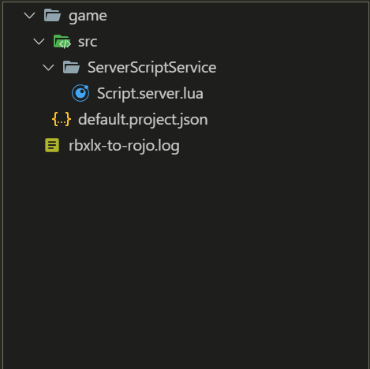

# rbxlx-to-rojo
Tool to convert existing Roblox games into Rojo projects by reading modern
binary (`.rbxl`, `.rbxm`) and XML (`.rbxlx`, `.rbxmx`) files.

# Using rbxlx-to-rojo
## Setup
Before you can use rbxlx-to-rojo, you need the following:

- A Roblox place or model file.
- Rojo for using the generated `default.project.json` and `src` directory.

Download the latest release of rbxlx-to-rojo here: https://github.com/rojo-rbx/rbxlx-to-rojo/releases
## Porting the game
Before you can port your game into Rojo projects, you need a place/model file. If you have an existing game that isn't exported:

- Go to studio, click on any place, and then click on File -> Save to file as.

- Create a folder and name it whatever you want.
### Steps to port the game:
1. Double-click on rbxlx-to-rojo on wherever you installed it.
2. Select the .rbxl file you saved earlier.
3. Now, select the folder that you just created.

If you followed the steps correctly, you should see something that looks like this:


You can also run it from a terminal:

```text
rbxlx-to-rojo.exe path\to\place.rbxl path\to\output-folder
```

The generated project contains:

- `src/` with extracted scripts and Rojo metadata.
- `default.project.json` with the Rojo project tree.
- `workspace.json` with the complete Workspace hierarchy and decoded properties.
- `startergui.json` with the complete StarterGui hierarchy and decoded properties.
- `replicatedstorage.json` with the complete ReplicatedStorage hierarchy and
  decoded properties.

Hierarchy properties retain their Roblox value type. For example, a Vector3 is
written as a typed JSON value instead of being flattened into a display string.
Internal Studio bookkeeping properties such as `HistoryId` and stylesheet
references are omitted. Instance references are written as paths such as
`Workspace.Baseplate`, null references are omitted, and properties equal to
their Roblox class defaults are culled. Workspace and Camera nodes contain
hierarchy only, without properties.

## License
rbxlx-to-rojo is available under The Mozilla Public License, Version 2. Details are available in [LICENSE.md](LICENSE.md).
